# RAG Chatbot Query Flow Diagram

## Query Processing Pipeline

```mermaid
flowchart TB
    subgraph Frontend["🖥️ Frontend (Browser)"]
        UI[/"User Input: chatInput field"/]
        JS["script.js: sendMessage()"]
        Display[/"Display Response + Sources"/]
    end

    subgraph API["🔌 API Layer"]
        FastAPI["FastAPI Server: app.py"]
        Endpoint["/api/query endpoint: @app.post"]
    end

    subgraph RAG["🧠 RAG System"]
        RAGSys["rag_system.py: query()"]
        Session["Session Manager: get_conversation_history()"]
    end

    subgraph AI["🤖 AI Generation"]
        AIGen["ai_generator.py: generate_response()"]
        Claude["Claude API: Anthropic"]
        Decision{{"Tool needed? (Course-specific?)"}}
    end

    subgraph Search["🔍 Search Tools"]
        ToolMgr["Tool Manager: execute_tool()"]
        SearchTool["CourseSearchTool: search_tools.py"]
    end

    subgraph Vector["📊 Vector Store"]
        VectorStore["vector_store.py: search()"]
        Embeddings["SentenceTransformer: Create embeddings"]
        ChromaDB[("ChromaDB: Vector Database")]
    end

    %% User Flow
    UI -->|"Step 1: Enter query"| JS
    JS -->|"Step 2: POST request"| FastAPI
    FastAPI -->|"Step 3: Route to endpoint"| Endpoint
    Endpoint -->|"Step 4: Call RAG system"| RAGSys

    %% RAG Processing
    RAGSys -->|"Step 5: Get history"| Session
    Session -->|"Step 6: Context"| AIGen
    RAGSys -->|"Step 7: Process query"| AIGen

    %% AI Decision Flow
    AIGen -->|"Step 8: API call"| Claude
    Claude -->|"Step 9: Analyze query"| Decision

    %% Direct Response Path
    Decision -->|"General Q"| DirectResponse["Step 10a: Direct Answer"]

    %% Tool Use Path
    Decision -->|"Course Q"| ToolMgr
    ToolMgr -->|"Step 10b: Execute search"| SearchTool
    SearchTool -->|"Step 11: Query vectors"| VectorStore
    VectorStore -->|"Step 12: Embed query"| Embeddings
    Embeddings -->|"Step 13: Similarity search"| ChromaDB
    ChromaDB -->|"Step 14: Return matches"| VectorStore
    VectorStore -->|"Step 15: Format results"| SearchTool
    SearchTool -->|"Step 16: Tool results"| AIGen

    %% Response Generation
    DirectResponse -->|"Step 17: Generate"| FinalResponse["Final Response"]
    AIGen -->|"Step 17: Synthesize with results"| FinalResponse

    %% Return Path
    FinalResponse -->|"Step 18: Return answer"| RAGSys
    RAGSys -->|"Step 19: Update session"| Session
    RAGSys -->|"Step 20: Return data"| Endpoint
    Endpoint -->|"Step 21: JSON response"| JS
    JS -->|"Step 22: Render markdown"| Display

    %% Styling
    classDef frontend fill:#e1f5fe,stroke:#01579b,stroke-width:2px
    classDef api fill:#fff3e0,stroke:#e65100,stroke-width:2px
    classDef rag fill:#f3e5f5,stroke:#4a148c,stroke-width:2px
    classDef ai fill:#e8f5e9,stroke:#1b5e20,stroke-width:2px
    classDef search fill:#fce4ec,stroke:#880e4f,stroke-width:2px
    classDef vector fill:#f3e5f5,stroke:#4a148c,stroke-width:2px
    classDef database fill:#fff9c4,stroke:#f57f17,stroke-width:3px

    class UI,JS,Display frontend
    class FastAPI,Endpoint api
    class RAGSys,Session rag
    class AIGen,Claude,Decision ai
    class ToolMgr,SearchTool search
    class VectorStore,Embeddings vector
    class ChromaDB database


```



## Data Flow Details

### Request Structure

```json
// Frontend → Backend
{
  "query": "What is backpropagation?",
  "session_id": "abc-123-def"
}
```

### Tool Execution

```json
// AI → Search Tool
{
  "name": "search_course_content",
  "input": {
    "query": "backpropagation algorithm",
    "course_name": "Deep Learning",
    "lesson_number": 3
  }
}
```

### Response Structure

```json
// Backend → Frontend
{
  "answer": "Backpropagation is an algorithm for training neural networks...",
  "sources": [
    "Deep Learning Fundamentals - Lesson 3",
    "Introduction to Neural Networks - Lesson 5"
  ],
  "session_id": "abc-123-def"
}
```

## Key Components

| Component         | File                    | Responsibility                       |
| ----------------- | ----------------------- | ------------------------------------ |
| **Frontend**      | `script.js`             | User interaction, API calls, display |
| **API Layer**     | `app.py`                | HTTP endpoints, request routing      |
| **RAG System**    | `rag_system.py`         | Orchestration, session management    |
| **AI Generator**  | `ai_generator.py`       | Claude API, tool decisions           |
| **Search Tools**  | `search_tools.py`       | Tool definitions, execution          |
| **Vector Store**  | `vector_store.py`       | Semantic search, ChromaDB interface  |
| **Doc Processor** | `document_processor.py` | Text chunking, embedding prep        |

## Processing Times (Typical)

- **Frontend → API**: ~10ms
- **Session Retrieval**: ~5ms
- **Claude API Call**: ~1-3s
- **Vector Search**: ~100-200ms
- **Response Generation**: ~1-2s
- **Total End-to-End**: ~2-5s

## Decision Logic

The AI decides whether to use search tools based on:

1. **Direct Answer** (No Search):

   - General knowledge questions
   - Definitions not course-specific
   - Meta questions about the system

2. **Search Required**:
   - Questions about specific courses
   - Lesson content queries
   - Instructor information
   - Course-specific examples

## Error Handling

Each stage has error handling:

- Frontend: Try/catch with user-friendly messages
- API: HTTPException with status codes
- RAG: Graceful fallbacks for missing sessions
- Vector Store: Empty results handling
- AI: Tool execution failures handled gracefully
